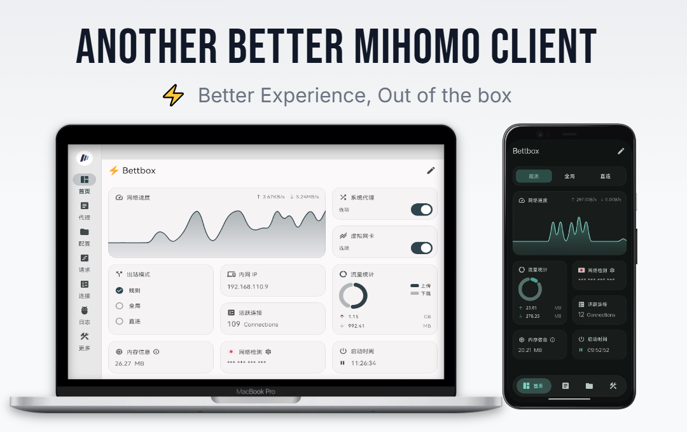

<h4 align="right">
  <a href="../README.md">简体中文</a> | <strong>English</strong> | <a href="README_ru.md">Русский</a> | <a href="README_fa.md">فارسی</a> | <a href="README_ja.md">日本語</a> | <a href="README_ko.md">한국어</a>
</h4>

<h1 align="center">⚡ Bettbox</h1>
<p align="center">
  <strong>Another Better Mihomo Client, Forked from FlClash</strong>
</p>

**Bettbox is a cross-platform traffic routing and DNS debugging tool, deeply built on the powerful Mihomo core. We focus on privacy, security, and refined feature details, dedicated to delivering a better client experience (The project has already taken the lead in passing manual security provenance review by the SignPath Foundation, and the Windows client is signed with an OV digital certificate).**

Guided by the principle of "Better Experience", Bettbox inherits the original sleek UI while deeply optimizing numerous details along with practical features and logic across platforms. Core characteristics and goals: smooth foreground, power-saving background — dedicated to becoming a better Mihomo client that runs stably over the long term with minimal resource consumption.

Bettbox stands for: Better Experience, Out of the box.


[](https://github.com/appshubcc/Bettbox/releases/latest) [](https://github.com/MetaCubeX/mihomo/releases/latest)

<p align="center">
  
</p>

---
### ✈️ Telegram Community

</div>

<div align="left">

[](https://t.me/appshub_chat) [](https://t.me/appshub_channel)

---
## 🚀 Core Features

* **Out-of-the-Box**: Robust permission handling and smooth TUN/VPN experience with optimized defaults for instant usability.
* **Meticulously Crafted**: Polished UI and interaction details. High FPS foreground animations, ultra-low mobile power consumption, and minimal desktop footprint.
* **Security First**: Core closely tracks the main Mihomo branch, follows the principle of least privilege across platforms, and is officially OV digitally signed by SignPath.
* **Rock-Solid Fault Tolerance**: Edge-case optimizations for extreme multi-platform scenarios and dual config verification for enterprise-grade stability.
* **Performance Focused**: Native desktop ARM64 support, hardware tiering, and deep Flutter optimizations to squeeze out every drop of hardware performance.
* **Enhanced Utilities**: Industry-first multi-platform seamless smart start/stop, Android sleep support, one-click QUIC toggle, and enhanced tray menu.
* **Visual Settings**: Even richer visual configuration parameters with real-time application — no tedious manual config editing required.
* **Home Widgets**: Multiple beautifully designed built-in widgets for real-time speed monitoring and system status at a glance on the home page.
* **Personalized Customization**: Rich color themes, custom icons/titles, and even 30 exquisite speedtest animations.
* **Custom Adaptation**: The first to support rule UI adaptation for JS override scripts along with convenient visual toggles.
* **Professional Code Editor**: Built-in refactored high-performance code-forge editor across platforms, matching IDE-level editing experience.
* **Device Compatibility**: Actively maintained Compatible builds for legacy OS versions and older hardware, extending device lifespans.
* **Zero Privacy Risk**: Fully open-source, ad-free, transparent CI/CD with full auditability, eliminating any background telemetry.
* **Community Driven**: Community feedback is carefully evaluated, prioritizing high-quality issues to ensure your voice is heard.

---
</div>

###   🛩️ Recommended Services
### IEPL Dedicated Line  〢  [BBXY](https://www.bbxy01.com/v2/register?code=c09R)

### Exclusive Discount Code (32% OFF): bettbox68

**Review** : ❚ ❚  Established premium line operated overseas for years, Tier-1 enterprise BGP ingress + GZ-HK & SH-JP dedicated lines, approx. ¥17/mo or ¥127/yr after discount, unlocking streaming media & AI, with excellent latency and reputation. Ideal for users prioritizing high stability. Pro tip: Don't forget to use the 32% OFF discount code, and check in daily in the dashboard to claim an extra 5-10GB bonus bandwidth.

--------------------------------
### Cost-Effective Direct  〢  [Liangxin Cloud](https://xn--9kqz23b19z.com/#/register?code=VTnrQYAj)  〢  [Chuixue Cloud](https://xn--9kqs1lo79d.com/#/register?code=skKMTab7)  〢  [YiFen](https://xn--4gqx1hgtfdmt.com/#/register?code=AuCiXprV)

**Review** : ❚  Mainly high-bandwidth or resource servers with relatively stable operation and low starting prices. 888GB / 1000GB non-expiring packages offer great cost-performance. Large allowance at affordable prices, ideal for budget users, backup traffic, or heavy downloading.

---
## 🛠️ Installation & Downloads

Please visit the **[[Releases]](https://github.com/appshubcc/Bettbox/releases)** page to download the latest installer for your platform.


* **Cross-Platform Desktop**: 
**Windows 8.1+:** (x64/arm64)
**Linux Kernel 5.4+:** (x64/arm64)
**macOS 10.15+:** (Intel/Apple Silicon)
* **Android 8.0+:** Android (ARMv8/ ARMv7/ x86_64/ Universal) 
* **Android TV:** Fully adapted, optional ARMv7 32-bit for low-memory devices
* **HarmonyOS NEXT:** Can be stably used with [[ZhuoYiTong]](https://harmonyos.cool/android-app)

**Other Installation Methods:**<br>
**ArchLinux:** <code>yay -S bettbox-bin or paru -S bettbox-bin</code> (Maintained by [ lyj404 ](https://github.com/lyj404/bettbox-aur))<br>
**AMD64=v1:** <code>yay -S bettbox-compatible-bin or paru -S bettbox-compatible-bin</code> (Maintained by [ VillagerTom ](https://github.com/VillagerTom))

---
## ❓ Frequently Asked Questions

1.  **Installation, Startup & Security Issues**:
   - Android devices: **Ensure sufficient background permissions are granted and minimum requirements are met**: Android 8.0+
   - Legacy desktop devices: Check if your CPU architecture **requires downloading a specific CPU-level Compatible version**.
   - **Security: Bettbox is fully open-source and transparent with zero telemetry. Current builds have passed SignPath security audit.**

2.  **Desktop FAQs**:
   - Windows Admin Permissions: Bettbox installer handles this in advance — **no manual re-authorization required**.
   - Unable to enable TUN mode: macOS and Linux users **must enter the correct password to grant network permissions**.
   - Other errors: Provide debug logs and **ensure no conflicting proxy software or services are running**.
   - If issues persist, please submit a GitHub Issue.

3.  **macOS Installation Notes**:
   - Download the appropriate `.dmg` file for your architecture (Intel / Apple Silicon) and double-click to open.
   - Drag the Bettbox icon into the `Applications` folder.
   - **Bypassing system security checks during installation or updates** ([as Apple Developer Certificate is not currently purchased](https://support.apple.com/en-us/102445)):
     - **Recommended**: Open `Applications`, **right-click the Bettbox icon**, select **"Open"**, and click **"Open"** again in the confirmation prompt.
     - **Alternative**: If blocked, go to System Settings -> Privacy & Security, scroll to find Bettbox, and click **"Open Anyway"**.
   - Upon enabling TUN mode for the first time, a password authorization prompt will appear; **please enter the password of the currently logged-in user to allow Bettbox to configure the network**.

4.  **Unable to Import Subscription Links**:
   - **Always try resetting the subscription link first** to ensure it is valid before importing.
   - If issues persist, please contact your service provider first. If debugging confirms it is caused by the app, please submit a GitHub Issue.

---

## 💻 Build & UI Customization

Building on Windows:

* Requires a Windows PC (OS ≥ Windows 10)
* Dependencies: Git, Visual Studio, Flutter 3.44.x, Golang, Inno Setup, Rust
```bash
* flutter pub get
* dart .\setup.dart windows --arch amd64 --out core (Build Core only)
* dart .\setup.dart windows --arch amd64 --out app --compatible (Optional Compatible build)
* Output binaries are located in the `dist/` directory
```

Custom Script UI Adaptation:

* Starting from v1.18.8, Bettbox supports external override scripts for UI adaptation. Taking AIsouler's **[Script/Config Repository](https://github.com/AIsouler/MyClash)** as an example, simply add the following declaration on the first line of your script to enable Bettbox built-in visual toggles:
* <code>const Compatible_With_Bettbox = { ruleOptionsEnable: true };</code>
* If a script mixes policy group switches with other feature switches, declare which ones belong to policy groups via `policyGroupOptions`. Undeclared switches are collected into an "⚙️ Other Settings" second-level page at the end of the list, while policy group switches keep the original list layout:

```js
const Compatible_With_Bettbox = {
  ruleOptionsEnable: true,
  // Names of the switches that belong to policy groups; must match the keys of ruleOptionsEnable exactly
  policyGroupOptions: ['🚀 Node Select', '🛑 Ad Block'],
};
```

* Without `policyGroupOptions`, or when the declared names match no switch, the layout stays exactly the same as before (all switches in a single list).

---

### ☕ Sponsorship

**If you find this project helpful, consider supporting development via:**

* TRON (TRC-20):   <code>TCkTtZfF2WrciZLaJj3e1aqrh3zdTnCkDa</code>
* Bitcoin: <code>bc1qu950cl6035qvllmzk6cfw3l30j2lg3cq9n6g6h</code>
---

## 🙏 Acknowledgments

<table>
  <tr>
    <td>
      
    </td>
    <td>
    Free code signing on Windows provided by <a href="https://signpath.io">SignPath.io</a>, certificate by <a href="https://signpath.org/">SignPath Foundation</a>
    </td>
  </tr>
</table>

**[FlClash GUI](https://github.com/chen08209/FlClash)** 〢 **[Mihomo Core](https://github.com/MetaCubeX/mihomo)**

Special thanks to all [Contributors](https://github.com/appshubcc/Bettbox/graphs/contributors) and open-source projects used or referenced:

[Zashboard](https://github.com/Zephyruso/zashboard), [CMFA](https://github.com/MetaCubeX/ClashMetaForAndroid), [Sparkle](https://github.com/xishang0128/sparkle), [SFA](https://github.com/SagerNet/sing-box-for-android), [HUSI](https://github.com/xchacha20-poly1305/husi), [V2rayN](https://github.com/2dust/v2rayN), [Bett-rules](https://github.com/appshubcc/bett-rules)

---

## 📄 License

GPL-3.0 License
